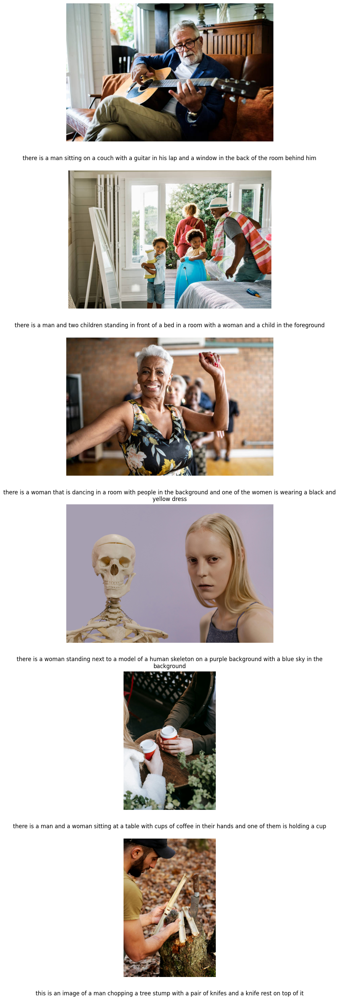

# SPONTEEN - High Quality Image Captioner
To start, enable the Docker Engine, and then execute:
## Setup
```bash
make docker-run
```
## Short description
A microservice based on `FastAPI` that leverages the first version of [BLIP large](https://huggingface.co/Salesforce/blip-image-captioning-large) via `Hugging Face` to caption images.
## Sample result
